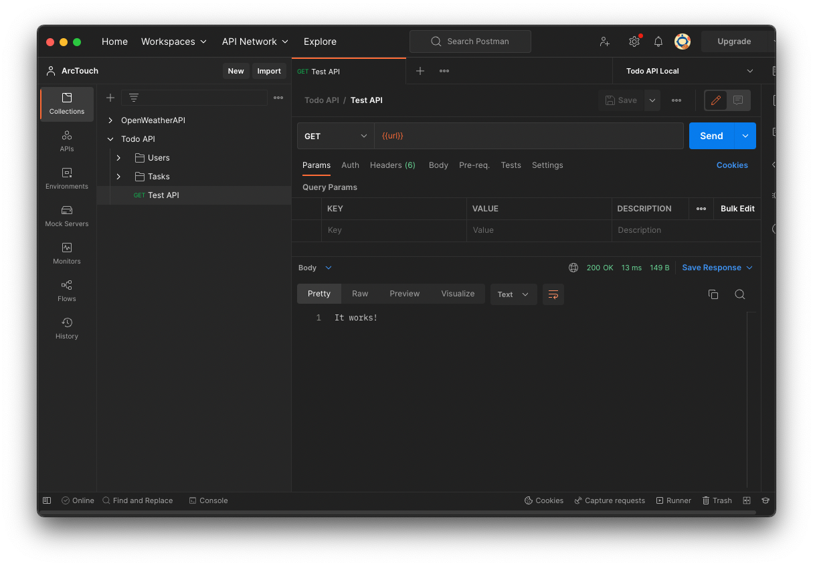
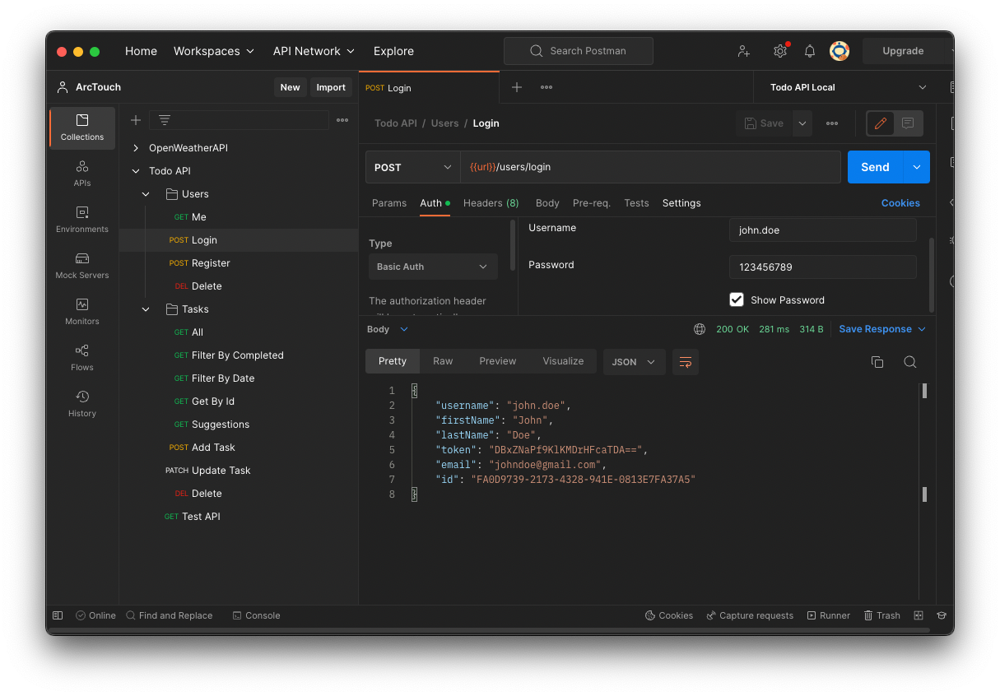

# Todo API

## Description
This respository is the source code of the API used in the mentorship program about RxSwift. It is written in [Swift Language](https://www.swift.org) with the [Vapor Framework](https://vapor.codes).
On the database side it is used the [MySQL](https://www.mysql.com) RDBMS

## Docker
This project uses Docker for development. Please, follow the steps on the [Notion Page](https://www.notion.so/arctouch/Docker-Installation-d9f7027366344a489d74a9429176d2ff) to install it correctly on your environment.

## Postman
To test the API methods it is recommended to use [Postman](https://www.postman.com/downloads/). After downloading and installing it, import the both collection and environment files to it:
- `Postman/Todo API.postman_collection.json`
- `Postman/Todo API.postman_environment.json`

## Getting Started

### Running the API
With the Docker installed on your machine and the Docker Daemon running, open the terminal and navigate to the projects root folder (the same level of the `docker-compose.yml` file.

On terminal run:
```bash
$ docker-compose up -d app
```

The first time you do it, docker will build the image of the `DockerFile`, so it will take a longer time. The next times you run the command above, it will be faster.
You should see the following output on terminal:
```bash
⠿ Container todoapi-db-1   Started
⠿ Container todoapi-app-1  Started 
```

To test if the API is up, call the **Test API** endpoint on Postman. You should see the response `It works!`



### Restoring the database backup

In order to have the initial data on the API, you should restore the backup on the MySql database. To do it, you can access the MySQL docker container and executing the `database_creation.sql` file.

With the docker containers up, type on terminal
```bash
$ docker ps
```
You should see a similar output:
```bash
CONTAINER ID   IMAGE               COMMAND                  CREATED          STATUS          PORTS                               NAMES
be7b158b3bfa   todo-a-p-i:latest   "./Run serve --env p…"   21 minutes ago   Up 21 minutes   0.0.0.0:8080->8080/tcp              todoapi-app-1
f5a477079bd3   mysql:8.0           "docker-entrypoint.s…"   47 hours ago     Up 39 minutes   0.0.0.0:3306->3306/tcp, 33060/tcp   todoapi-db-1
```

Grab the _CONTAINER ID_ of the MySQL container. In the example above it is `f5a477079bd3`, but yours should be different. Then, run the command `docker exec -it [CONTAINER ID] /bin/bash` on terminal. With the example container id the command is:
```bash
$ docker exec -it f5a477079bd3 /bin/bash
```

Now you are inside the MySQL container. To restore the database type:
```bash
$ mysql -u vapor_username -p < database_creation.sql
```
The `mysql` application will ask for the user's password. So you type `vapor_password` and press enter.
You can now leave the MySQL container pressing `control+D`.

To test if the data has been restored, call the `login` endpoint on Postman, with the following credentials:
- Username: john.doe
- Password: 123456789



Now you are all set up to use the API locally.

## Troubleshooting
FIXME: add here common errors and workarounds setting up the API